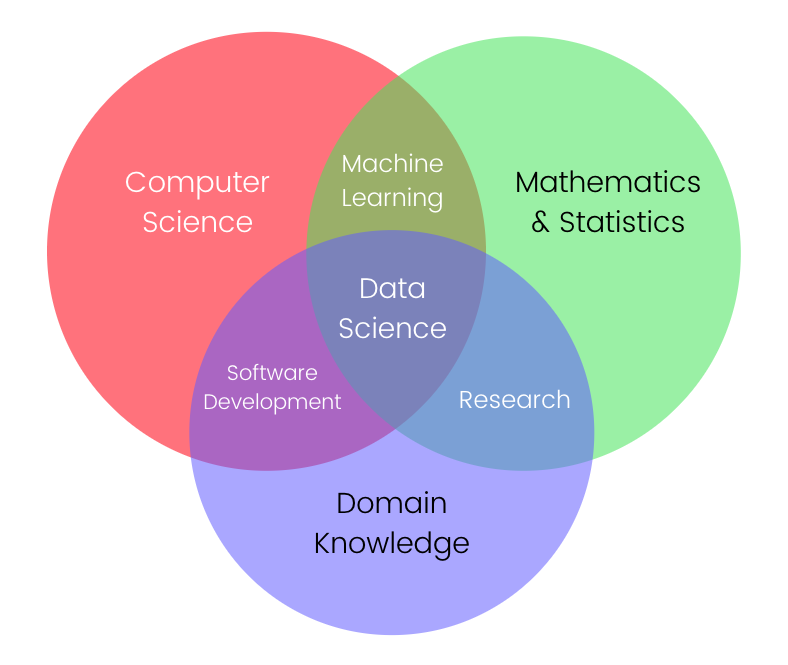
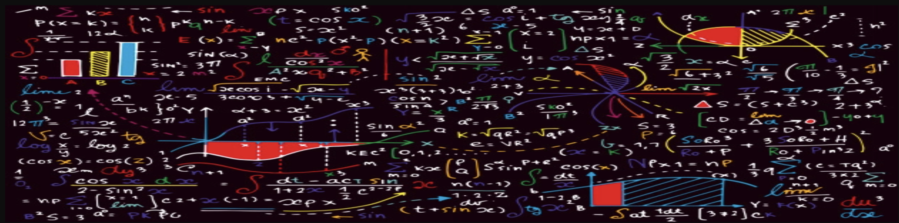

# Comprehensive Linear Algebra Course in Python

Welcome to the Comprehensive Linear Algebra Course in Python repository! This course, curated by [Your Name], is designed to provide a thorough understanding of linear algebra concepts, mathematical representations, and practical implementations using Python.

## Introduction

Embark on a journey to master linear algebra, an essential field for various scientific and engineering applications. This repository covers a wide range of topics, including vectors, matrices, linear equations, transformations, eigenvalues, eigenvectors, singular value decomposition, and more.

## Table of Contents

- [Vectors](#vectors)
  - [Mathematical and Graphical Representation in R2](#mathematical-and-graphical-representation-of-vectors-in-r2)
  - [Mathematical and Graphical Representation in R3](#mathematical-and-graphical-representation-of-vectors-in-r3)
  - [Hands-on Implementation in Python](#hands-on-implementation-in-python)
  - [Magnitude of a Vector (Vector Norms)](#magnitude-of-a-vector-vector-norms)
  - [Direction of a Vector](#direction-of-a-vector)
  - [Components of a Vector in R2](#components-of-a-vector-in-r2)
  - [Components of a Vector in R3](#components-of-a-vector-in-r3)
  - [Vector Addition](#vector-addition)
  - [Multiplying a Vector with Scalar Value](#multiplying-a-vector-with-scalar-value)
  - [Basis and Unit Vectors](#basis-and-unit-vectors)
  - [Linear Combination and Span of Vectors](#linear-combination-and-span-of-vectors)
  - [Vector Dot Product](#vector-dot-product)
  - [Vector Cross Product](#vector-cross-product)
  - [Orthogonal and Orthonormal Vectors](#orthogonal-and-orthonormal-vectors)

- [Matrices](#matrices)
  - [Row Vector vs Column Vector](#row-vector-vs-column-vector)
  - [Zero Matrix, Ones Matrix, Random Integer Matrix](#zero-matrix-ones-matrix-random-integer-matrix)
  - [Square Matrix, Symmetric Matrix, Triangular Matrix, Diagonal Matrix](#square-matrix-symmetric-matrix-triangular-matrix-diagonal-matrix)
  - [Identity Matrix, Scalar Matrix, Orthogonal Matrix](#identity-matrix-scalar-matrix-orthogonal-matrix)
  - [Matrix Addition, Matrix-Scalar Multiplication](#matrix-addition-matrix-scalar-multiplication)
  - [Matrix Multiplication (Hadamard Product), Matrix Multiplication (Dot Product)](#matrix-multiplication-hadamard-product-matrix-multiplication-dot-product)
  - [Matrix-Vector Multiplication](#matrix-vector-multiplication)
  - [Frobenius Norms](#frobenius-norms)
  - [Transpose of a Matrix, Determinant of a Matrix](#transpose-of-a-matrix-determinant-of-a-matrix)
  - [Inverse of a Matrix, Trace of a Matrix, Rank of a Matrix](#inverse-of-a-matrix-trace-of-a-matrix-rank-of-a-matrix)

- [Linear Equations](#linear-equations)
  - [System of Linear Equations](#system-of-linear-equations)
  - [Solving Methods: Substitution, Elimination, Graphing](#solving-methods-substitution-elimination-and-graphing)
  - [Consistent vs Inconsistent Systems](#consistent-vs-inconsistent-systems)
  - [Plotting Linear Equations with Three Variables](#plotting-linear-equations-with-three-variables)
  - [Solving Set of Three Linear Equations with Three Variables](#solving-set-of-three-linear-equations-with-three-variables)
  - [Matrix Algebra for Solving Linear Equations](#solving-system-of-linear-equations-using-matrix-algebra)
  - [Gaussian Elimination, Gauss Jordan, Cramer's Rule](#solving-system-of-linear-equations-using-gaussian-elimination-gauss-jordan-cramers-rule)
  - [Matrix Inverse Method, Limitations](#solving-system-of-linear-equations-using-matrix-inverse-method-limitations)
  - [Categories of Linear Equations Systems](#categories-of-linear-equations-systems)
  - [Overdetermined and Underdetermined Systems](#overdetermined-and-underdetermined-systems)
  - [Least Squares Method for Inconsistent Overdetermined Systems](#least-squares-method-for-inconsistent-overdetermined-systems)
  - [Linear Equations in Machine Learning](#modeling-linear-equations-in-machine-learning)

- [Linear Transformations](#linear-transformations)
  - [Applying a Matrix to a Vector](#applying-a-matrix-to-a-vector)
  - [Algebra Behind Linear Transformations in 2-D Space](#algebra-behind-linear-transformations-in-2-d-space)
  - [Identity Matrix, Scaling, Reflection, Shear, Rotation, Translation Matrices](#applying-an-identity-matrix-scaling-reflection-shear-rotation-translation-matrices)
  - [Multiple Transformations Simultaneously](#apply-multiple-transformations-simultaneously)
  - [Scaling, Translation, Rotation in Three-Dimensional Space](#scaling-translation-and-rotation-in-three-dimensional-space)

- [Eigenvalues and Eigenvectors](#eigenvalues-and-eigenvectors)
  - [Abstract View, Calculating Eigenvalues and Eigenvectors](#abstract-view-calculating-eigenvalues-and-eigenvectors)
  - [Paper-Pencil and Python Calculations](#calculating-eigenvalues-and-eigenvectors-of-a-matrix-using-paper-pencil-and-python)
  - [Relationships with Determinant and Trace](#relationship-between-determinant-and-eigenvalues-of-a-matrix)
  - [Not All Transformation Matrices Have Real Eigenvalues](#not-all-transformation-matrices-have-real-eigenvalues)
  - [Eigendecomposition for Symmetric Matrices](#eigendecomposition-for-symmetric-matrices)

- [Singular Value Decomposition (SVD)](#singular-value-decomposition-svd)
  - [Calculating SVD using NumPy, SciPy, Scikit-learn](#calculating-svd-using-numpy-scipy-scikit-learn)

- [Image Compression and Principal Component Analysis (PCA)](#image-compression-and-principal-component-analysis-pca)
  - [Dimensionality Reduction Examples](#examples-dimensionality-reduction-of-housing-dataset-using-numpy-digits-dataset-using-scikit-learn-iris-dataset-using-scikit-learn-data-visualization)

- [Moore-Penrose Pseudoinverse](#moore-penrose-pseudoinverse)

## How to Use

To make the most of this comprehensive course:

1. Clone this repository to your local machine using `git clone`.
2. Explore the relevant section or topic that interests you.
3. Review the provided code examples and explanations.
4. Run the Python code examples to see the concepts in action.
5. Complete the exercises to reinforce your understanding.
6. Use this repository as a reference for interviews, technical challenges, or personal projects
